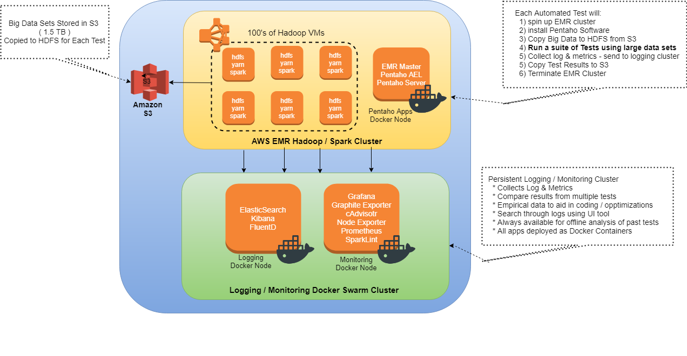

# Pentaho Big Data Test Harness
A test harness for testing out Pentaho products across large data sets (>1TB)

This project contains scripts & code to test out Pentaho products at scale.  And monitoring tools to measure performance over time.

# Background

## Problems Addressed

Before diving into the details of this solution, let's look at the problems it addresses & the requirements it fulfils.

* Lack of ability to test Pentaho solutions at scale
  - Customers run our products on Terrabyte size data sets
  - But we test on small datasets (500 MB - 10GB)
  - Currently, we have no means to test our solutions against TB datasets before release.

* Lack of Empirical Data
  - How does AEL on Spark compare with running vanilla spark?  
  - How does it compare with running same on Pentaho Server or Worker Nodes?
  - Currently, we have no way quantifying the difference or measuring performance over time.

* Lack of ability to experiment
  - How do our products perform on 5-node cluster?  -Vs- 100-node cluster? –Vs- 1,000 node cluster?
  - How do they perform against GB of data, TB, PB?  
  - What’s the breaking point?
  - Currently, we have no way of quickly experimenting to answer those questionws without costing an arm and a leg.

## Requirements

Given the problems described earlier, the solution must:

* Allow us to test real-world large data sets (1TB+).
* Allow us to test using real-world large-scale Hadoop clusters (100 – 1,000 node clusters.  16+ GB RAM, tons of CPU cores)
* Allow us to monitor tests, record metrics, gather data that give insights to how our products perform.
* Allow us to compare results of different tests.
* Allow us to quickly experiment with different configurations with little effort.
* Not cost the size of a small government or army.

# Solution - Big Data Test Harness

## High-Level Overview

There are 3 major components to the Big Data Test Harness:

1. **Big Data Sets stored in S3** 
   - Real World Data Sets to test against are stored in AWS S3
   - This ensures we have TB+ of repeatable data to test against.
   
2. **AWS EMR Hadooop Ckluster** 
   - This is the cluster which runs workloads to test - Spark jobs, Pentaho / AEL Jobs, workner 
   - This cluster is provisioned dynamically each time a test is run.  And dstroyed each time a test ends.
   - Completely automated.  1 script builds out all infrastructure.
   - Number of VMs, CPU, Mem, Disk Size are all configurable.  Quickly experiment.
   - Spin up, run test, then spin down. Only pay for the few hours the test runs

3. **Logging & Monitoring Cluster**
   - Even though EMR workload clusters are ephemeral and only live for the life of the test, they generate metrics and logs and write them to a central logging / monitoring cluster.
   - Can view test results even after test cluster is terminated.  
   - Can compare and trend test results over time.
   
# Usage Info

## Pre-Requisites

The big data test harness depends on a number of requirements on your local workstation.  Please have the following installed:

* Linux 
  - Most tools that BDTH uses rely on Linux (preferably Ubuntu).  
  - If you are not running a linux or MacOS local machine, you can use a Virtual Machine, like Oracle Virtual Box
  - All custom BDTH scripts are written bash
  
* [AWS CLI](https://aws.amazon.com/cli/)  
  - Command Line Interface for interacting with AWS
  - Used to dynmically build out the AWS infrastructure
  
* [Terraform](https://www.terraform.io/)
  - Tool to automate building out infrastructure (Infrastructure as Code)
  - In our case, Terraform will build out all the AWS infrastructure - Networking, VMS, EMR clusters, Load Balancers, etc .

* [Ansible](https://www.ansible.com/)
  - IT Automation tool
  - In our case, once the infrastructure is built provisioned, Ansible will install any necessary software (Docker, AEL, etc) and do any neccessary configuration (set up Docker Swarm, configure AEL, etc)
  
* [Docker Engine](https://www.docker.com/)
  - Container technology
  - In our case, most of we will use docker to:
    + Build custom docker images
    + Test docker containers locally

* [Vagrant](https://www.vagrantup.com/)
  - Optional 
  - A development environment that features a Linux VM
  - In our case, there is a vagrant project already set up that includes all the software mentioned above already installed and ready to go
  - Makes getting set up a breeze
  - Install Vagrant, VirtualBox and then clone this project to start the vagrant dev environment
    + https://github.com/pentaho-jrice/jrice-hadoop-apache
    
## Usage Workflow

Here is a high-level overview of the workflow for the Big Data Test Harness.  The details will be covered later.

BDTH is designed to be simple to use (althought there is a lot going on under the hood)

###Step 1 - Upload Big Data Test Datasets to S3

* Create a bucket to hold your big data set

* Preferably, your entire big data set should be under a single bucket / folder combination

### Step 2 - Provision the Logging & Monitoring cluster

* The logging & monitoring cluster is meant to be fixed and permanent cluster.  So you should only need to do this once.

* There is a combination of Terraform & Ansible scripts that when run, will completely build out the cluster:
  - Create all the AWS resources for the cluster 
  - Set up Docket Swarm and configure it
  - Deploy 22 logging & monitoring containers to the cluster
  
* Run this single batch script which will build out the infraustructure
  - https://github.com/pentaho-jrice/jrice-big-data-test-harness/blob/master/provision/admin-cluster/scripts/env-admin-cluster-create.sh
  
* After that script is run, the following logging and monitoring applications will be availale for use on the following ports

| App Name | URL | Description |
| -------- | ---- | ----------- |
| Logging Proxy UI| logging-proxy.bdth.hitachivantara.com | Reverse Proxy UI - See all URLs being served |
| KIbana UI | kibana.bdth.hitachivantara.com | Kibana is a log viewer and visualizer.  Can view / seearch logs generated by Spark, AEL, etc|
| Elastic Search API | es.bdth.hitachivantara.com | ElasticSearch is the persistent storage for logs.  If you are familiar with ElasticSearch, you coulde use the API to search raw logs.  Most times you won't need this low-level access.  You use Kibana. |
| Grafana UI | grafana.bdth.pentaho.com | Grafana is a visualization tool for viewing metrics.  Spark metrics are captured during tests and stored in prometheus.  Grafana graphs those metrcis so you can see how test jobs performed. |
| Alert Manager | alerts.bdth.pentaho.com | Alerting manager for the spark cluster.  You can use this tool to set up and view alerts. |
| Prometheus DB | prometheus.bdth.pentaho.com | Prometheus is a time-series database for capturing metrics.  You can use this UI to get low-level access to data in prometheus and query the metrics data.  9 times out of 10, you will use Grafana to view the data |

### Step 3 - Execute a BDTH Test

* Executing a BDTH Test involves running 1 script that will:
  - Provision an EMR Cluster
  - Copy Big Data Set from S3 to EMR HDFS
  - Configure AEL
  - Run Test
  - Tear Down EMR Cluster
  
* Run this single batch script which will Execute the test
  - https://github.com/pentaho-jrice/jrice-big-data-test-harness/blob/master/provision/emr-cluster/scripts/run-spark-test.sh
  
  
